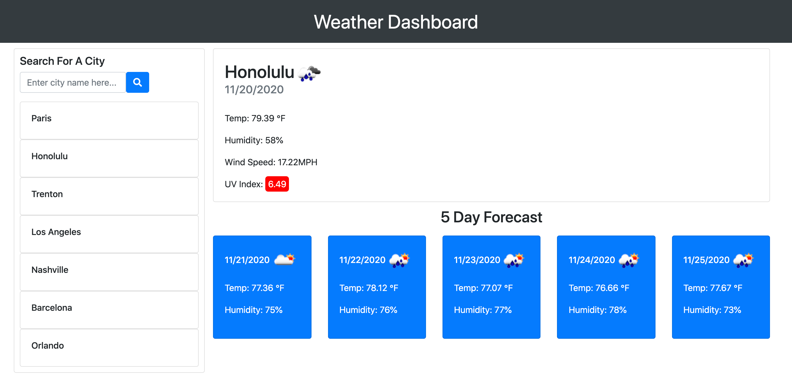

# Weather Dashboard

## Description

In this project my goal was to build a Weather Dashboard featuring dynamically updated HTML and CSS. Through the utilization of the OpenWeather API this application is able to retrieve the current forecast, the current UV index, and the 5 day projected forecast for as many cities they search. 

### Dashboard
When the user is looking at the current forecast they will see the city name, date, an icon representing the current weather condition, the temperature, humidity percentage, wind speed, and the UV index. 

The UV index is color coded to depict the UV conditions. If the UV is green the conditions are favorable. If it is orange they are moderate, and if red they are severe. 

The 5 day projected forecast section displays the date, an icon representing the future weather condition, the future temperature, and the future humidity percentage.

### Local Storage
Using the users local storage, the current sessions city search history will be displayed on the left side of the dashboard. The user can click on any of their previous city searches and the weather data will display on the dashboard. When the user reopens their application, they will have the city they last searched loaded onto their dashboard. 

## Screenshot

## Link
https://briannahebeler.github.io/Weather-Dashboard/
